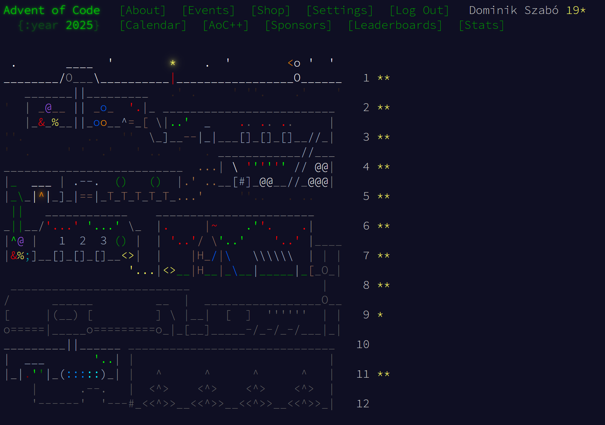

# Advent of Code 2025

## Languages used
Haskell, Prolog, Go, C#, Java, Kotlin, C, C++

## Languages by day
Day1 - Haskell

Day2 - Prolog

Day3 - Go

Day4 - C#

Day5 - Java

Day6 - Kotlin

Day7 - C

Day8 - Kotlin

Day11 - C++

 

